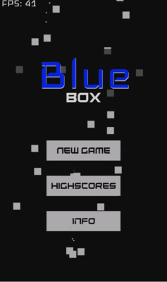
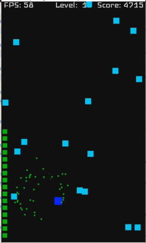

# Blue Box
Casual android game made in 2017 from scratch.

> Let's make your commuting a little less boring?
> 
> One thumb is what you need, avoid falling blocks and get all lives. As time passes it gets > faster, like your commute after playing this game. Challenge your friends, compare high > scores. Updates coming soon.

**Video Demo**  

**Play Store**  
https://play.google.com/store/apps/details?id=self.frota.guilherme.teste

**Sreenshots**  

# Features:
- Bilingual support (Portuguese and English)
- Uses its own Game Engine (Based on [MasterEngine](https://github.com/guiquintelas/master-engine)) 
- Advanced game progression algorithm, getting progressively harder and challenging
- Balanced across multiple mobile screens sizes, respecting pixel density and dimensions 
- Custom font
- Pause/Resume 
- Highscore tracking 
